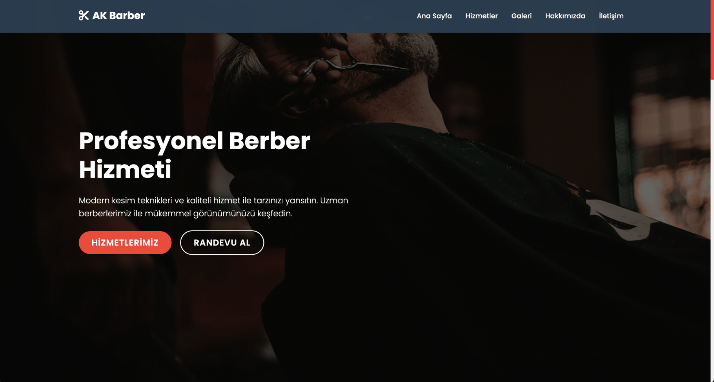
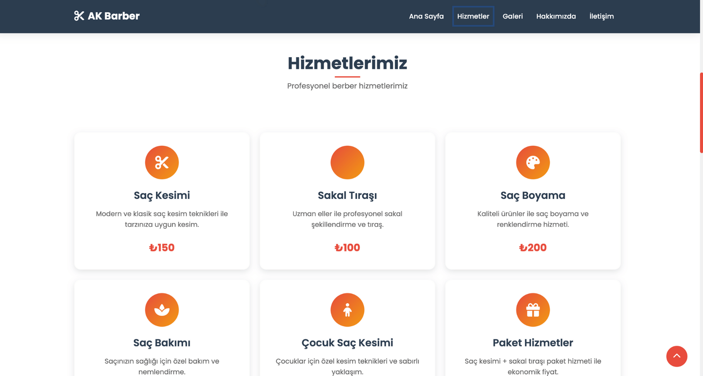
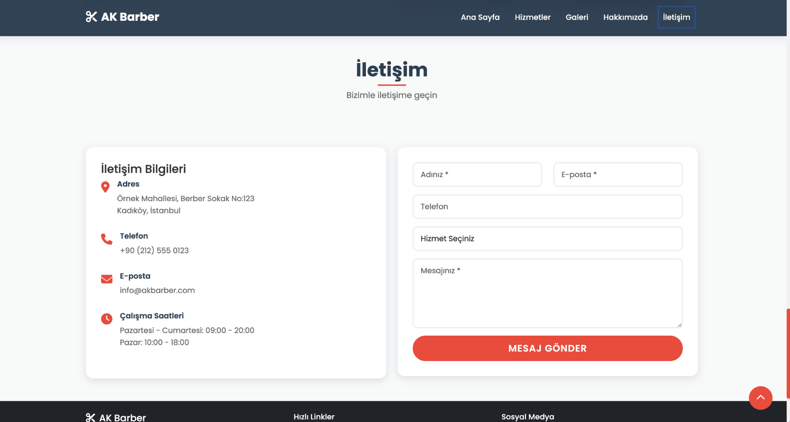

# AK Barber - Profesyonel Berber Salonu Web Sitesi

<div align="center">
  
  
  
  
  
</div>

<div align="center">
  <h1>✂️ AK Barber - Profesyonel Berber Salonu Web Sitesi</h1>
  <p><strong>Modern, responsive ve SEO dostu berber salonu web sitesi</strong></p>
  <p>Bootstrap 5, HTML5, CSS3 ve JavaScript ile geliştirildi. Ücretsiz olarak indirin ve kendi işletmenize göre özelleştirin!</p>
  
  <a href="https://ak-hosting.github.io/ak-barber/" target="_blank">
    
  </a>
  <a href="mailto:ak@ak-pro.com">
    
  </a>
  <a href="https://github.com/ak-hosting/ak-barber/issues">
    
  </a>
</div>

## 📸 Ekran Görüntüleri

<div align="center">
  
  
  
</div>

## 🚀 Özellikler

- **🎨 Modern Tasarım**: Bootstrap 5 ile tamamen responsive tasarım
- **⚡ Hızlı Yükleme**: Optimize edilmiş görseller ve kod
- **📧 İletişim Formu**: SMTP entegrasyonu ile çalışan form
- **🖼️ Galeri**: Lightbox özellikli görsel galeri
- **🎭 Animasyonlar**: Smooth scroll ve CSS animasyonları
- **🔍 SEO Optimize**: Meta etiketleri ve yapılandırılmış veri
- **📱 Mobile First**: Tüm cihazlarda kusursuz deneyim
- **🐳 Docker Desteği**: Kolay kurulum ve deployment
- **🛡️ Güvenlik**: CSP başlıkları ve güvenlik önlemleri

## 📁 Proje Yapısı

```
ak_barber/
├── index.html              # Ana HTML dosyası
├── assets/
│   ├── css/
│   │   └── style.css       # Ana CSS dosyası
│   └── js/
│       └── script.js       # JavaScript dosyası
├── .env.example            # E-posta yapılandırması örneği
├── README.md               # Bu dosya
└── LICENSE                 # Lisans dosyası
```

## 🚀 Hızlı Başlangıç

### Yöntem 1: Docker ile (Önerilen)
```bash
# 1. Projeyi klonlayın
git clone https://github.com/ak-hosting/ak-barber.git
cd ak-barber

# 2. Docker ile başlatın
docker-compose up -d

# 3. Tarayıcınızda açın
open http://localhost:8080
```

### Yöntem 2: Manuel Kurulum
```bash
# 1. Projeyi klonlayın
git clone https://github.com/ak-hosting/ak-barber.git
cd ak-barber

# 2. Basit HTTP sunucusu başlatın
python3 -m http.server 8000
# veya
npx serve .

# 3. Tarayıcınızda açın
open http://localhost:8000
```

## 🛠️ Detaylı Kurulum

### 1. **Projeyi klonlayın:**
   ```bash
   git clone https://github.com/ak-hosting/ak-barber.git
   cd ak-barber
   ```

### 2. **Dosyaları düzenleyin:**
   - `index.html` dosyasındaki içerikleri kendi işletmenize göre güncelleyin
   - `assets/css/style.css` dosyasındaki renkleri ve stilleri özelleştirin
   - Görselleri kendi görsellerinizle değiştirin

### 3. **E-posta yapılandırması:**
   - `.env.example` dosyasını `.env` olarak kopyalayın
   - E-posta ayarlarınızı yapılandırın

### 4. **Web sunucusunda çalıştırın:**
   ```bash
   # Python ile basit sunucu
   python -m http.server 8000
   
   # Node.js ile
   npx serve .
   
   # PHP ile
   php -S localhost:8000
   ```

## 📧 İletişim Formu Kurulumu

İletişim formunun çalışması için SMTP yapılandırması gereklidir:

### 1. **Dosyayı kopyalayın:**
```bash
cp .env.example .env
```

### 2. **SMTP ayarlarınızı girin:**
```env
# SMTP Ayarları
SMTP_HOST=smtp.gmail.com
SMTP_PORT=587
SMTP_USER=your-email@gmail.com
SMTP_PASS=your-app-password

# E-posta Ayarları
FROM_EMAIL=your-email@gmail.com
TO_EMAIL=info@yourbusiness.com
```

### 3. **Gmail App Password oluşturun:**
1. [Google Hesap Güvenliği](https://myaccount.google.com/security) sayfasına gidin
2. "2 Adımlı Doğrulama"yı etkinleştirin
3. "Uygulama Şifreleri" bölümünden yeni şifre oluşturun
4. Bu şifreyi `SMTP_PASS` alanına yazın

### 4. **Test edin:**
Form gönderdikten sonra e-posta alıp almadığınızı kontrol edin.

## 🎨 Özelleştirme

### Renkler
CSS dosyasındaki CSS değişkenlerini değiştirerek renkleri özelleştirebilirsiniz:

```css
:root {
    --primary-color: #2c3e50;    /* Ana renk */
    --secondary-color: #e74c3c;  /* İkincil renk */
    --accent-color: #f39c12;     /* Vurgu rengi */
}
```

### İçerik
- `index.html` dosyasındaki metinleri kendi işletmenize göre güncelleyin
- Görselleri `assets/images/` klasörüne ekleyin ve HTML'deki src'leri güncelleyin
- İletişim bilgilerini güncelleyin

### Hizmetler
Hizmetler bölümündeki kartları kendi hizmetlerinize göre düzenleyin:

```html
<div class="service-card">
    <div class="service-icon">
        <i class="fas fa-cut"></i>
    </div>
    <h4>Hizmet Adı</h4>
    <p>Hizmet açıklaması</p>
    <div class="service-price">₺150</div>
</div>
```

## 📱 Responsive Tasarım

Site tüm cihazlarda mükemmel görünür:
- **Desktop**: 1200px ve üzeri
- **Tablet**: 768px - 1199px
- **Mobile**: 767px ve altı

## 🚀 Performans Optimizasyonu

- Lazy loading görseller
- CSS ve JS minifikasyonu
- Görsel optimizasyonu
- CDN kullanımı
- Browser caching

## 🔧 Teknik Detaylar

- **HTML5**: Semantic markup
- **CSS3**: Modern CSS özellikleri
- **JavaScript ES6+**: Modern JavaScript
- **Bootstrap 5**: Responsive framework
- **Font Awesome**: İkonlar
- **Google Fonts**: Typography

## 📜 Kredi ve Atıf

Bu projeyi kullanıyorsanız, lütfen sitenizin footer kısmında veya uygun bir alanda şu şekilde atıf yapın:

```html
Geliştirici: a.koc - https://github.com/ak-hosting
```

## 📞 Destek & İletişim

### 🆘 Yardım mı lazım?
- **📧 E-posta**: ak@ak-pro.com
- **🐙 GitHub**: https://github.com/ak-hosting
- **🌐 Web Sitesi**: https://ak-pro.com
- **🐛 Hata Bildirimi**: https://github.com/ak-hosting/ak-barber/issues

### 💰 Ücretli Hizmetler
Özel istekler ve özelleştirmeler ücretli olarak gerçekleştirilir:
- Özel tasarım değişiklikleri
- Yeni özellikler ekleme
- SEO optimizasyonu
- Hosting ve domain kurulumu
- Teknik destek

**💡 İletişime geçin**: ak@ak-pro.com

## 📄 Lisans & Yasal Bilgiler

Bu proje MIT lisansı altında lisanslanmıştır. Detaylar için `LICENSE` dosyasına bakın.

### 🛡️ Yasal Uyarılar:
- Bu proje eğitim amaçlı oluşturulmuştur
- Ticari kullanım için gerekli lisansları kontrol edin
- Görseller Unsplash'ten alınmıştır (ticari kullanıma uygun)
- Font Awesome ikonları kullanılmıştır
- Bootstrap 5 framework'ü kullanılmıştır

## 👨‍💻 Geliştirici

**a.koc** - https://github.com/ak-hosting

### 📋 Geliştirici Bilgileri:
- **Ad Soyad**: a.koc
- **GitHub**: https://github.com/ak-hosting
- **E-posta**: ak@ak-pro.com
- **Web Sitesi**: https://ak-pro.com

## 🔄 Güncellemeler

### v1.0.0
- İlk sürüm
- Temel özellikler
- Responsive tasarım
- İletişim formu

## 🤝 Katkıda Bulunma

1. Fork edin
2. Feature branch oluşturun (`git checkout -b feature/AmazingFeature`)
3. Commit edin (`git commit -m 'Add some AmazingFeature'`)
4. Push edin (`git push origin feature/AmazingFeature`)
5. Pull Request oluşturun

## 📝 Changelog

### v1.0.0 (2024-01-01)
- ✅ İlk sürüm yayınlandı
- ✅ Responsive tasarım
- ✅ İletişim formu
- ✅ Galeri özelliği
- ✅ Animasyonlar
- ✅ SEO optimizasyonu

---

## ❓ Sıkça Sorulan Sorular

### Q: İletişim formu çalışmıyor, ne yapmalıyım?
A: `.env` dosyasındaki SMTP ayarlarını kontrol edin ve geçerli bir uygulama şifresi kullandığınızdan emin olun.

### Q: Görseller yüklenmiyor, sorun nedir?
A: Görsel yollarının `index.html` içinde doğru olduğundan emin olun.

### Q: Site responsive değil, ne yapmalıyım?
A: Bootstrap 5 kullanıldığı için otomatik olarak responsive olmalı. Tarayıcı cache'ini temizleyin.

### Q: Docker ile nasıl çalıştırırım?
A: `docker-compose up -d` komutu ile başlatabilirsiniz.

### Q: Özelleştirme nasıl yapılır?
A: `assets/css/style.css` dosyasındaki CSS değişkenlerini değiştirin.

### Q: Ücretli hizmetler nelerdir?
A: Özel tasarım, yeni özellikler ve teknik destek ücretli olarak sunulur.

---

**Not**: Bu proje eğitim amaçlı oluşturulmuştur. Ticari kullanım için gerekli lisansları kontrol edin. 